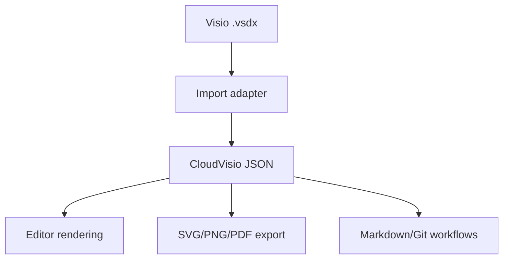

# File Format Strategy

## Recommendation

Use CloudVisio JSON as the semantic internal and automation-facing format, while supporting draw.io-compatible files and `.vsdx` import.

Do not use `.vsdx` as the primary internal product format.

## Why Not Use `.vsdx` as the Core Format

`.vsdx` is valuable for compatibility, but it is not ideal as the native format for a new web-first editor.

Reasons:

- It is optimized around Microsoft Visio's application model.
- It is harder to use for AI generation and natural language editing.
- It is harder to review in Git.
- It adds complexity to every editor operation.
- Perfect compatibility would slow down product development.

## Format Layers

## CloudVisio JSON Responsibilities

CloudVisio JSON should describe:

- pages
- layers
- shapes
- connectors
- text labels
- connection points
- styles
- templates
- metadata
- diagram type
- semantic roles, such as clock, signal, power, feedback, and control path

## Import Strategy

`.vsdx` import should be treated as a compatibility bridge:

1. Parse or use draw.io import to load `.vsdx`.
2. Convert supported objects into editable diagram objects.
3. Preserve basic appearance where practical.
4. Report unsupported or degraded features.
5. Save future edits in CloudVisio/draw.io-compatible format.

## Export Strategy

MVP export formats:

- CloudVisio JSON
- SVG
- PNG
- PDF

Later export formats:

- `.drawio`
- Markdown embedding
- `.vsdx` export

## Schema Validation

CloudVisio JSON should have a formal JSON Schema so files can be validated in CI and checked before import/export.
